# Grupo 4

- [David Andres Santos Mosquera (Lider)](https://github.com/DavidSantos004)
- [Juan Sebastian Torra Garcia](https://github.com/jstorra)
- [Jershon Orlando Espitia Rey](https://github.com/JershonEspitia)
  
#
# 
DESARME

## Planteamiento del problema

A lo largo de la historia, hemos sido testigos del indiscriminado empleo de una variedad de armas, desde las convencionales hasta las más letales como las nucleares, biológicas y químicas. Esta imprudente utilización tanto por parte de ciudadanos como de gobiernos ha tenido repercusiones significativas en la tranquilidad y estabilidad, tanto a escala nacional como internacional. Lo que se busca con el "Desarme" es la reducción o eliminación total de las armas de cualquier tipo con el propósito de promover la paz, seguridad y estabilidad a nivel global. Sin embargo, esta problemática se enfrenta a varios desafíos y consideraciones que dificultan su implementación efectiva.

Muchas organizaciones han sido creadas con el propósito de ayudar a cumplir el papel de mediador y poder dar la solución al porte y uso desmedido de armas de cualquier tipo. Una de estas y la que más destaca es la ONU (Organización de las Naciones Unidas), que desde sus inicios tuvo como objetivo principal cumplir esta tarea a mayor escala regulando el uso de armas de gran impacto, como por ejemplo: armas nucleares, armas químicas, armas biológicas.

Debido a esto, se busca brindar más información a la población en general sobre el "Desarme". Las medidas que se han tomado a lo largo de la historia, lo que ha causado el uso precipitado de armas de todo tipo, problemas que ha generado a nivel internacional, organizaciones a cargo de implementar esta medida; y todo lo relacionado con el "Desarme".

## Objetivo
Crear un sitio web informativo que integre una amplia variedad de fuentes confiables y actualizadas, con el propósito de proporcionar a los usuarios información precisa y objetiva acerca de los eventos y avances relacionados con el desarme a escala global. El sitio web se diseñará con la finalidad de permitir a las personas acceder de manera sencilla a datos verificados sobre el proceso de desarme en todo el mundo, y estará desarrollado bajo las tecnologías de HTML, CSS y BOOTSTRAP.

## Estado del arte

En la búsqueda constante de la paz y la seguridad internacionales, las Naciones Unidas (ONU) se han consolidado como un epicentro de esfuerzos colaborativos en desarme y no proliferación. La Asamblea General de la ONU, identificada en los enlaces [el-desarme-en-la-asamblea-general](https://disarmament.unoda.org/es/el-desarme-en-la-asamblea-general/) y [el-desarme-en-el-consejo-de-seguridad](https://disarmament.unoda.org/es/el-desarme-en-el-consejo-de-seguridad/), emerge como un espacio donde los Estados miembros debaten y generan documentos para abordar temas cruciales, como el control de armamentos, la reducción de arsenales y la paz. Esto facilita el intercambio de perspectivas y la cooperación para definir soluciones efectivas.

El Consejo de Seguridad de la ONU, resaltado en [el-desarme-en-el-consejo-de-seguridad](https://disarmament.unoda.org/es/el-desarme-en-el-consejo-de-seguridad/), desempeña un papel primordial en la estabilidad global. Mediante resoluciones y debates, se enfrentan cuestiones críticas, como armas de destrucción masiva y medidas de control de armamentos, impactando directamente en la seguridad internacional.

La Conferencia de Desarme, como se menciona en [conference-on-disarmament](https://disarmament.unoda.org/conference-on-disarmament/), se erige como un foro esencial bajo el Departamento de Asuntos de Desarme de la ONU. Este espacio multilateral facilita la negociación y promoción de acuerdos vinculantes para regular el desarme y el control de armas, enfocándose en la cooperación entre Estados.

Adicionalmente, la Comisión de Desarme de las Naciones Unidas, como se destaca en [comision-de-desarme-de-las-naciones-unidas](https://disarmament.unoda.org/es/comision-de-desarme-de-las-naciones-unidas-2/), emerge como un órgano subsidiario de la Asamblea General. Su labor en la promoción de propuestas y medidas para el control de armamentos y la reducción de arsenales, abarcando desafíos actuales como el desarme nuclear y la seguridad en el espacio ultraterrestre, refleja el compromiso de la ONU con la paz y seguridad a nivel global.

#### Fuentes consultadas:
- https://www.un.org/disarmament/es/
- https://www.un.org/disarmament/es/el-desarme-en-la-asamblea-general/
- https://www.un.org/disarmament/es/el-desarme-en-el-consejo-de-seguridad/
- https://disarmament.unoda.org/conference-on-disarmament/
- https://www.un.org/disarmament/es/comision-de-desarme-de-las-naciones-unidas-2/
- https://www.un.org/disarmament/es/junta-consultiva-en-asuntos-de-desarme/
- http://www.unidir.org/
- https://www.iaea.org/es
- https://www.ctbto.org/
- https://www.opcw.org/es
- https://www.unmas.org/en
- https://treaties.unoda.org/
- https://www.un.org/disarmament/sg-agenda/es/
- https://www.un.org/disarmament/publications/basic-guide/
- https://disarmament.unoda.org/publications/yearbook/
- https://www.un.org/disarmament/es/folletos-informativos-sobre-cuestiones-de-desarme/

# Proceso de desarrollo

Para el desarrollo de nuestro proyecto se llevaron a cabo diferentes etapas, la primera de ellas fue el análisis y desarrollo de la problemática y el objetivo general de nuestro proyecto. Seguido se realizó un estado del arte que nos brindara información y fuentes confiables sobre el desarme para poder abstraer la información que estaría disponible en el sitio web. Después se definió cuál sería el formato de página web que mejor se adaptara para el objetivo planteado, una vez establecido el formato "página web informativa" se continuó con el diseño (wireframes) tanto para "desktop" como "móvil". Luego de estár definidos los diseños se continuó con la maquetación haciendo uso de la tecnología HTML, asegurándonos que estuviera semánticamente correcta y que tuviera coherencia para finalmente darle estilo con la tecnología CSS y el uso del framework Bootstrap únicamente para un componente del sitio web.

# Wireframes
## Desktop
La pantalla principal tiene un menú de navegación el cual tiene un logotipo y unos enlaces de referencia, además tiene un título referente a la temática a tratar con un banner de fondo.

  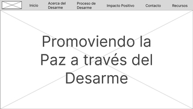

La segunda pantalla tiene un titulo, una imagen de referencia y el contenido general relacionado a la temática.

  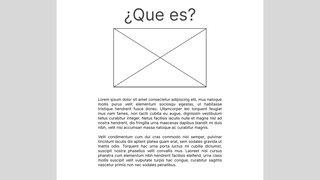

La tercera pantalla tiene un titulo y se divide en los subtemas referentes a las diferentes etapas que se deben llevar a cabo en un proceso de desarme.

  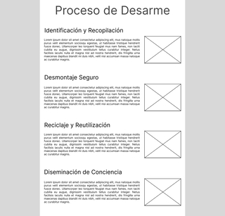

La cuarta pantalla contiene un título que hace referencia a algunos casos de éxito que se han logrado en diferentes prrocesos de desarme, se distribuye en un formato de 2 columnas.

  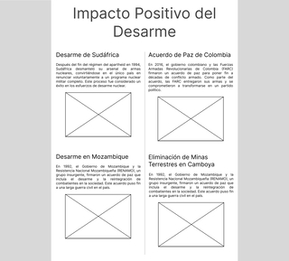

La quinta pantalla contiene un formulario con los campos de nombre, correo y el mensaje que desea.

  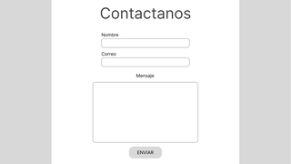

La última pantalla contiene la sección de recursos y el footer de la página, en la sección de recursos se encuentran diferentes links en dónde se podrá encontrar más información referente a la temática.

  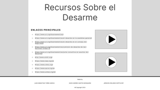

#
## Mobile
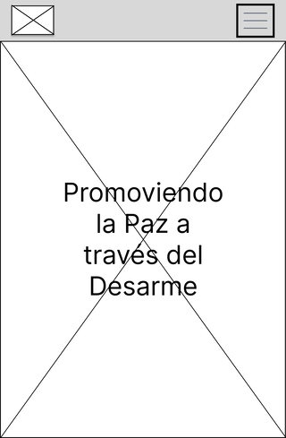
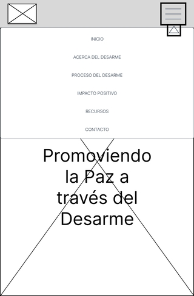

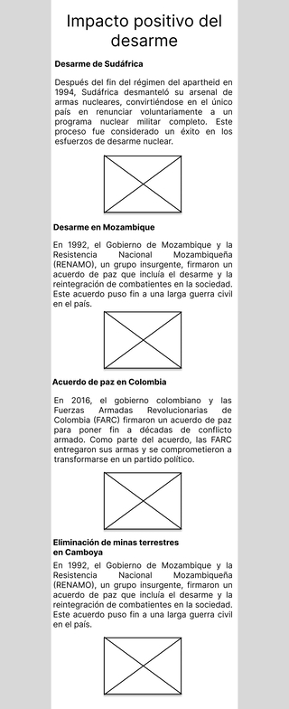
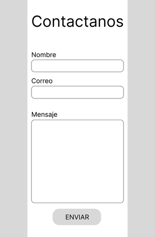
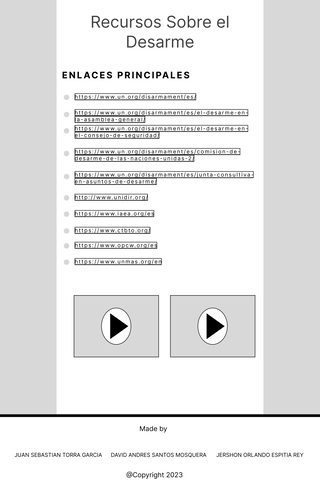
