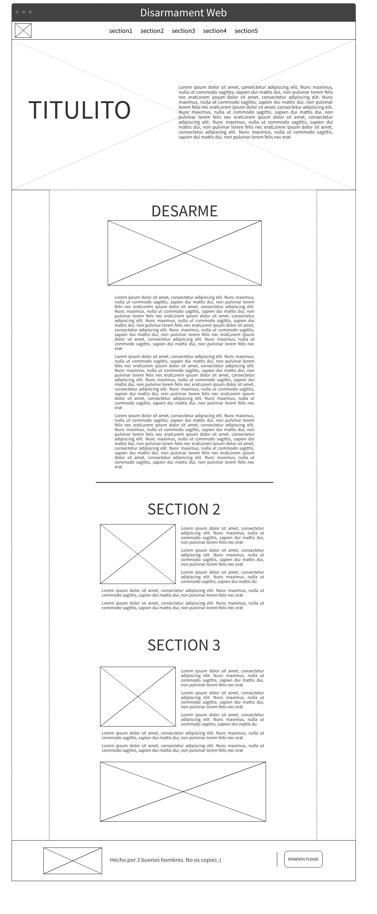

# Grupo 4

- [David Andres Santos Mosquera (Lider)](https://github.com/DavidSantos004)
- [Juan Sebastian Torra Garcia](https://github.com/jstorra)
- [Jershon Orlando Espitia Rey](https://github.com/JershonEspitia)
  
#
# 
DESARME

## Planteamiento del problema

A través de los años se ha visto el uso de armas, ya sea de fuego, nucleares, biológicas, químicas, etc., de forma desmedida por la población y los gobiernos. Esto ha causado problemas en la paz y seguridad a nivel nacional e internacional.  Lo que se busca con el "Desarme" es la reducción o eliminación total de las armas de cualquier tipo con el propósito de promover la paz, seguridad y estabilidad a nivel global. Sin embargo, esta problemática se enfrenta a varios desafíos y consideraciones que dificultan su implementación efectiva.

Muchas organizaciones han sido creadas con el propósito de ayudar a cumplir el papel de mediador y poder dar la solución al porte y uso desmedido de armas de cualquier tipo. Una de estas y la que más destaca es la ONU (Organización de las Naciones Unidas), que desde sus inicios tuvo como objetivo principal cumplir esta tarea a mayor escala regulando el uso de armas de gran impacto, como por ejemplo: armas nucleares, armas químicas, armas biológicas.

Debido a esto, se busca brindar más información a la población en general sobre el "Desarme". Las medidas que se han tomado a lo largo de la historia, lo que ha causado el uso precipitado de armas de todo tipo, problemas que ha generado a nivel internacional, organizaciones a cargo de implementar esta medida; y todo lo relacionado con el "Desarme".

## Objetivo
Desarrollar un sitio web informativo implementando el uso de diversas fuentes que brindan informacion sobre acontecimientos relacionados con el desarme a nivel mundial, para que las personas puedan encontrar informacion veraz.

## Estado del arte

En la búsqueda constante de la paz y la seguridad internacionales, las Naciones Unidas (ONU) se han consolidado como un epicentro de esfuerzos colaborativos en desarme y no proliferación. La Asamblea General de la ONU, identificada en los enlaces [el-desarme-en-la-asamblea-general](https://disarmament.unoda.org/es/el-desarme-en-la-asamblea-general/) y [el-desarme-en-el-consejo-de-seguridad](https://disarmament.unoda.org/es/el-desarme-en-el-consejo-de-seguridad/), emerge como un espacio donde los Estados miembros debaten y generan documentos para abordar temas cruciales, como el control de armamentos, la reducción de arsenales y la paz. Esto facilita el intercambio de perspectivas y la cooperación para definir soluciones efectivas.

El Consejo de Seguridad de la ONU, resaltado en [el-desarme-en-el-consejo-de-seguridad](https://disarmament.unoda.org/es/el-desarme-en-el-consejo-de-seguridad/), desempeña un papel primordial en la estabilidad global. Mediante resoluciones y debates, se enfrentan cuestiones críticas, como armas de destrucción masiva y medidas de control de armamentos, impactando directamente en la seguridad internacional.

La Conferencia de Desarme, como se menciona en [conference-on-disarmament](https://disarmament.unoda.org/conference-on-disarmament/), se erige como un foro esencial bajo el Departamento de Asuntos de Desarme de la ONU. Este espacio multilateral facilita la negociación y promoción de acuerdos vinculantes para regular el desarme y el control de armas, enfocándose en la cooperación entre Estados.

Adicionalmente, la Comisión de Desarme de las Naciones Unidas, como se destaca en [comision-de-desarme-de-las-naciones-unidas](https://disarmament.unoda.org/es/comision-de-desarme-de-las-naciones-unidas-2/), emerge como un órgano subsidiario de la Asamblea General. Su labor en la promoción de propuestas y medidas para el control de armamentos y la reducción de arsenales, abarcando desafíos actuales como el desarme nuclear y la seguridad en el espacio ultraterrestre, refleja el compromiso de la ONU con la paz y seguridad a nivel global.

#### Fuentes consultadas:
- https://www.un.org/disarmament/es/
- https://www.un.org/disarmament/es/el-desarme-en-la-asamblea-general/
- https://www.un.org/disarmament/es/el-desarme-en-el-consejo-de-seguridad/
- https://disarmament.unoda.org/conference-on-disarmament/
- https://www.un.org/disarmament/es/comision-de-desarme-de-las-naciones-unidas-2/
- https://www.un.org/disarmament/es/junta-consultiva-en-asuntos-de-desarme/
- http://www.unidir.org/
- https://www.iaea.org/es
- https://www.ctbto.org/
- https://www.opcw.org/es
- https://www.unmas.org/en
- https://treaties.unoda.org/
- https://pmt-eu.hosted.exlibrisgroup.com/primo-explore/search?institution=41UNOG&vid=41DHL_V2&tab=default_tab&search_scope=41unog_alma_ny&mode=basic&displayMode=full&bulkSize=10&highlight=true&dum=true&query=any,contains,Desarme&displayField=all&pcAvailabiltyMode=true
- https://www.un.org/disarmament/sg-agenda/es/
- https://www.un.org/disarmament/publications/basic-guide/
- https://www.un.org/disarmament/es/publications/yearbook/
-https://www.un.org/disarmament/es/folletos-informativos-sobre-cuestiones-de-desarme/

#
## Wireframes

